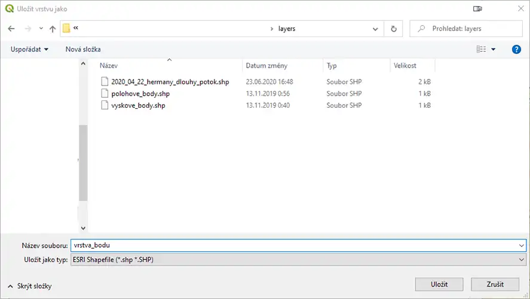
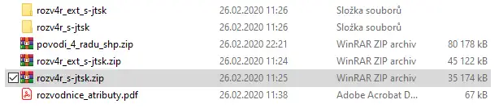
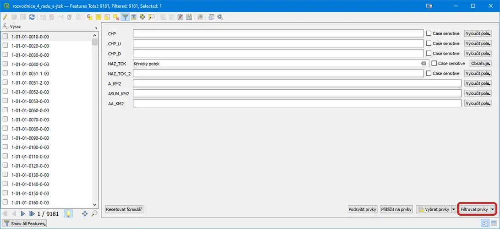

# Metodický pokyn č. 3 k programu QGIS

Poslední aktaulizace: 4. 7. 2022

## Obsah

[Slovo úvodem](#slovo-úvodem)

[Potřebné vybavení](#potřebné-vybavení)

- [Hardware](#hardware)
- [Software](#software)

[Uživatelské rozhraní](#uživatelské-rozhraní)

[Zásuvné moduly](#zásuvné-moduly)

[Instalace zásuvných modulů](#instalace-zásuvných-modulů)

[Prvotní nastavení QGIS po instalaci](#prvotní-nastavení-qgis-po-instalaci)

[Mapové zdroje, WMS, práce s SRS](#mapové-zdroje-wms-práce-s-srs)

- [Mapové zdroje](#mapové-zdroje)
    - [WMS](#wms)
    - [Import WMS serverů](#import-wms-serverů)
- [Vložení mapy z WMS serveru do projektu](#vložení-mapy-z-wms-serveru-do-projektu)

[Vrstvy a práce s nimi](#vrstvy-a-práce-s-nimi)

- [Přidání vektorové SHP vrstvy z existujícího souboru](#přidání-vektorové-shp-vrstvy-z-existujícího-souboru)
- [Drag&drop](#dragdrop)
- [Použití menu "Vrstva"](#použití-menu-vrstva)
- [Nová vrstva SHP - shapefile](#nová-vrstva-shp---shapefile)
- [Kreslení bodů](#kreslení-bodů)
- [Kreslení linií](#kreslení-linií)
- [Kreslení polygonů](#kreslení-polygonů)
- [Stylování vrstev](#stylování-vrstev)
- [Kopírování stylu](#kopírování-stylu)
- [Průhlednost](#průhlednost)

[Export vrstev do Geopackage](#export-vrstev-do-geopackage)

[Prvky a práce s nimi](#prvky-a-práce-s-nimi)

- [Výběr prvku](#výběr-prvku)
- [Atributová tabulka](#atributová-tabulka)
- [Popisky prvků](#popisky-prvků)
- [Georeferencování](#georeferencování)
- [Výběr povodí](#výběr-povodí)
- [Informace o verzi souboru](#informace-o-verzi-souboru)

## Slovo úvodem

V tomto metodickém pokynu si osvojíte základní práci s programem QGIS a
vrstvami, které používáme. Program QGIS má dvě základní funkce: jednak
je editorem a jednak je prohlížečem (zkratka GIS - geografické
informační systémy - umožňují zobrazovat dohromady geografická data
různých formátů, souřadnicových systémů a zobrazení, z různých
online/offline zdrojů a propojovat je s txt/databázovými informacemi.

Geografická data, jsou data (prvky), které mají přiřazenou geografickou
polohu, nebo jim jí můžeme přiřadit.

To znamená, že umožňuje jednak načíst do svého prostředí státní mapové
podklady jako ortofotomapy, základní mapu a množství dalších
informačních vrstev, které si můžeme prohlížet z běžně dostupných
serverů WMS. Lze prohlížet i tzv. rastrová data neboli obrázky -
například TIFF, JPG, webp aj.

Program zároveň umožňuje tvořit a přidávat naše vlastní vrstvy,
nejčastěji ve vektorovém formátu (SHP/GPKG).

To splňuje základní výhodu, že můžeme vidět všechna data na jednom místě
a funguje to podobně jako v minulosti známý prosvětlovací stůl, kde jsme
na podkladovou mapu přikládali jednotlivé průsvitné pauzovací papíry,
abychom zjistili, pokud možno všechna data o daném území.

QGIS však umožňuje neskonale lepší možnosti - vrstvy umí podle potřeby
barvit, ohraničovat, zesvětlovat či ztmavovat, způhledňovat. Umí měřit
plochy a délky linií, seskupovat vrstvy do potřebných skupin. Umožňuje
zvolit jakékoliv měřítko zobrazení, slučovat vrstvy, psát texty, vkládat
vlastní body a fotografie z terénu. Dokonce přídavné, tzv. zásuvné
moduly umí provést řez profilem apod., přilepit mapu, projekt či letecký
snímek do měřítka a orientace podkladové vrstvy a mnoho dalšího.

Z toho plyne, že se jedná o ideální nástroj pro mapování změn v krajině
a navržení potřebných opatření pro její renovaci. Zároveň po přidání
katastrální mapy umožňuje maximálně respektovat veškeré státní i
soukromé zájmy a řešit případné střety.

## Potřebné vybavení

Co se vybavení týče, lze použít prakticky jakékoliv zařízení, na kterém
běžně pracujete. Může to být notebook či stolní počítač. Pro pohodlnou
práci je nezbytné pracovat s myší.

### Hardware

QGIS je velice přívětivý program, co se hardwarových nároků týče. Z
praxe lze říct, že i na 10 let starém zařízení lze s úspěchem program
spustit a používat. Tomu samozřejmě bude odpovídat i styl práce.

Nainstalovaný program zabere cca 1,9 GB místa na pevném disku (Windows
10 Pro 64bit).

Pokud máte možnost pracovat na dvou monitorech, využijte toho. Uvidíte,
že takto se vám s programem bude pracovat o mnoho lépe.

Alternativně lze program ovládat i za pomoci grafického tabletu,
dosáhnete tak například přirozenějšího a přesnějšího zakreslování
vektorových vrstev pomocí pera.

Je dobré mít na paměti, že je vhodné mít rychlé připojení k internetu.
Od toho se odvíjí rychlost práce a uživatelský zážitek při práci např. s
mapovými zdroji z WMS serverů. Každý pohyb s takovou mapou znamená
opětovné načtení ze serveru, byť mapou pohnete i o jediný pixel.

### Software

Požadavky na softwarové vybavení jsou totožné jako u jiných programů, na
které jste zvyklí. QGIS lze instalovat na operačních systémech Microsoft
Windows, MacOS i na různých distribucích Linuxu.

Sledujte prosím aktualizace jak pro váš počítač, tak i aktualizace
samotného programu QGIS. Vždy pracujte v nejaktuálnější stabilní verzi
QGISu.

## Uživatelské rozhraní

Uživatelské rozhraní má pět základních prvků:

1.  Lišta menu

2.  Lišta nástrojů

3.  Panel

4.  Mapové okno

5.  Stavový řádek

**Lišta menu** nabízí přístup ke všem běžným funkcím QGISu rozdělených
do patřičných skupin. Většina položek menu je přístupná i v liště
nástrojů (a vice versa). Další položky menu se mohou objevit
nainstalováním zásuvných modulů.

**Lišta nástrojů** nabízí přístup k většině běžných funkcí QGISu bez
nutnosti hledat je v menu. Velký počet z nich má přímý vliv na práci s
mapou v mapovém okně. Po najetí myší na jakoukoliv ikonu nástroje se
zobrazí vyskakovací nápověda s názvem nebo popisem funkce, případně se
zobrazí i klávesová zkratka. Lištu nástrojů si lze seřadit tak, jak
uznáte za vhodné, také lze jakoukoliv skupinu nástrojů zavřít. Přesun
skupiny nástrojů provedete chycením za levý tečkovaný okraj a posunutím
na zvolené místo. Pro zavření skupiny nástrojů klikněte pravým tlačítkem
myši na aktivní (nezašedlou) ikonu libovolného nástroje a v zobrazené
nabídce odškrtněte nástroje, které nechcete mít aktivní.

**Panely** jsou interaktivní prvky uživatelského rozhraní, ve kterých
lze provádět různé akce, jakými jsou např. změna vlastností,
zaškrtávání, změna hodnot zapsáním nebo pomocí posuvníku atp. I panely
lze libovolně přesouvat nebo otevírat a zavírat.

**Mapové okno** je prvek, který je z celého QGISu nejdůležitější. Zde se
zobrazují mapy, vrstvy a vlastně vše, co provádíte v pomocí nástrojů a
panelů.

**Stavový řádek** zobrazuje obecné informace o zobrazení mapy a
zpracovaných nebo dostupných akcích a nabízí nástroje pro správu
zobrazení mapy, jako jsou např. mapové souřadnice pod kurzorem myši,
měřítko mapy, stavový pruh načítání mapových dat z WMS serveru, SRS
projektu atp.

## Zásuvné moduly

Zásuvné moduly jsou pomocné nástroje k rozšíření funkcí samotného QGISu.
Jejich využití je čistě individuální a lze jej s námi konzultovat.
Zásuvné moduly nejsou jen z dílny vývojářů QGISu, vyvíjí je i komunita
uživatelů, proto se může stát, že některé z nich nemusí správně fungovat
(obzvláště jsou-li označeny jako experimentální).

### Instalace zásuvných modulů

Ukázkově si to ukážama na dříve používaném modulu "ImportPhotos".
Postupujte následovně:

V menu "Zásuvné moduly" vyberte položku "Správa a instalace Zásuvných
modulů".

V okně "Zásuvné moduly" na záložce "Vše" zadejte do pole vyhledávání
text "importphotos".

Ve výsledcích hledání klikněte na řádek s názvem modulu (1), poté
klikněte vpravo dole na tlačítko "Instalovat zásuvný modul".

Nyní zavřete okno se zásuvnými moduly. Právě nainstalovaný zásuvný modul
se vám objevil v horní nástrojové liště.

## Prvotní nastavení QGIS po instalaci

Toto je první nastavení QGIS, které se provádí pouze jednou, po
instalaci (nyní je součástí ZK_default, ale je lepší si to
překontrolovat).

V menu zvolte Nastavení / Nastavení vlevo záložka SRS nastavit:

-   *SRS pro projekty / Použít výchozí SRS:* EPSG: 5514 - S-JTSK /
    Krovak East North

-   *SRS pro vrstvy / Výchozí SRS pro vrstvy:* EPSG: 5514 - S-JTSK /
    Krovak East North

-   *SRS pro vrstvy / Dotázat se na SRS*

-   Zaškrtnout *Planimetrická měření*

Dále vlevo přepněte na záložku Transformace a nastavte dle obrázků:

-   Stisknout zelené +

-   *Zdrojový SRS: EPSG: **3857 - WGS84 / Pseudo-Mercator***

-   *Cílový SRS: EPSG: **5514 - S-JTSK / Krovak East North***

-   V tabulce transformací kliknutím označit druhý řádek - *Přesnost*
    **1 m**

Pomocí OK zavřete okno s vybíráním transformací.

## Mapové zdroje, WMS, práce s SRS

### Mapové zdroje

Mapové zdroje nám slouží k popisu stávajících krajinných fenoménů v
různých typech zobrazení, případně k historické rekonstrukci obrazu
krajiny, k popisu situace a terénu, stavu vodních systémů, půd,
geologické situace, tektonických linií, instalované infrastruktury či
promítnutí vlastnických vztahů (katastrální mapy) atd.

Veřejně dostupné mapové zdroje jsou buď zdarma, případně je musíme
zakoupit.

Pro účely projektu Živé krajiny používáme:

**mapové zdroje** v souřadnicovém systému S-JTSK (Systém jednotné
trigonometrické sítě katastrální) - tzv. Křovákovo zobrazení. V projektu
musí mít každá vrstva označení souřadnicového systému - SRS: EPSG:5514
S-JTSK / Krovak East North nebo EPSG:4326 WGS84, které jsou navzájem
rovnocenné, co se týče umístění zobrazení. Typ SRS záleží na tom, v
jakém souřadnicovém systému jsou dodávána data ze serveru, přednostně
používáme EPSG:5514. Níže uvedený seznam mapových zdrojů uvádíme podle
pořadí z Modelu Křinice tak, jak jsou řazeny vrstvy od nejspodnější po
nejsvrchnější. Požadujeme prosím držet níže uvedené pořadí ve všech
dalších vámi replikovaných projektech.

**Nastavení SRS projektu** (V základním projektu je SRS už nastavené)

Kliknutím na ikonu globusu se otevře okno "Vlastnosti projektu - SRS".
Zde odškrtněte pole "No CRS" (1), poté nastavíte SRS na EPSG:5514 S-JTSK
/ Krovak East North a stisknete tlačítko "Použít".

Někdy je vhodné využít i lokální mapové zdroje. Kupříkladu Liberecký
kraj nabízí vlastní WMS server, na kterém je mnoho zajímavých vrstev (v
rozsahu kraje). Např. ortofoto od roku 1938 až po současnost, císařské
otisky a další.

1.  **Ortofotomapa ČR**

Sestavena z aktuálních leteckých snímků povrchu země.

2.  **Základní mapa 1:10 000**

Zobrazení situace jakož i možnosti získávat odhadem přehled o nadmořské
výšce a sklonitosti terénu pomocí vrstevnic (s ekvidistancí - odlehlostí
neboli převýšením po 2 m mezi liniemi).

3.  **Katastrální mapa - DKM 1:1 000, to je základní, pro které je mapa
    tvořena. Nebo žádné.**

Slouží k vyhledání parcel, jejich čísel, kultur pozemků (orná, louka,
pastvina, les, ostatní plocha apod.), hranic jednotlivých katastrálních
území a jejich názvů. Hranice parcel jsou viditelné od měřítka 1:5 000,
čísla parcel od 1:2 000.

4.  **Historické letecké snímky** (nutno zakoupit jako rastr na VGHMÚ
    Dobruška,
    [[http://www.mapy.army.cz/vghmur-dobruska]{.underline}](http://www.mapy.army.cz/vghmur-dobruska))

Využíváme k:

1\) rekonstrukci vývoje krajiny srovnáním snímků zejména z roku cca
1937, 1947, 1955 a dále, až po snímky dokumentující scelování pozemků a
rozorání mezí,

2\) případné analýze podzemních odvodňovacích systémů - jednak přímo
viditelným zachycením prováděných prací nebo pomocí vyprahlostních
příznaků (za sucha viditelné tmavší struktury ve vegetaci vlivem většího
vlhka nad trubkami v zemi),

3\) případné analýze vývoje říčního systému v průběhu času (posuny
meandrů apod.).

5.  **II. vojenské mapování (Františkovo) z roku 1836 - 1852, v měřítku
    1:28 800**

Tuto historickou mapu využíváme k vymezení kultur, zejména luk a
případným nálezům historických, již zaniklých vodních ploch. K hrubé
představě o tvaru terénu používají šrafy.

6.  **Územní plány**

využíváme k převzetí potřebných návrhových opatření do našeho modelu a k
omezení střetů mezi návrhem zavodnění a našimi opatřeními.

7.  **HEIS - voda**

Slouží k zachycení stávající vodopisné sítě, ochranných pásem
hygienického ochrany včetně vymezení záplavových území (vymezuje
standardně 5letá voda, 20letá voda a 100letá voda/zátopa, pokud je
státem vůbec zpracováno).

8.  **Geologie**

Využíváme zejména zobrazení tektonických linií k posouzení
hydrogeologické situace.

9.  **CO (císařský otisk) - stabilního katastru (1826 až 1843)** (nutno
    zakoupit jako rastr
    [[https://archivnimapy.cuzk.cz/uazk/pohledy/archiv.html]{.underline}](https://archivnimapy.cuzk.cz/uazk/pohledy/archiv.html))

historická mapa zachycuje mj. velmi přesně vodopisnou síť i polní trať.
Umožňuje rekonstrukci hydrologické struktury krajiny (zatravnění
údolnice, vodní plochy) včetně velikosti a hustoty meandrů.

10. **3D**

Digitální mapa reliéfu (DMR) ČÚZK - využíváme pro umístění jednotlivých
opatření do krajiny tak, abychom co nejvíce využili možností terénu,
případně zjistili tvar terénu, který není dostatečně zřetelný z
vrstevnic zejména v příkrém svahu, či lesní trati.

11. **Katastr**

Dotčené katastrální území dané obce či obcí v SHP, kterého se dotýká
řešené území (zhotoví LK).

12. **Povodí**

Řešené povodí - podklad pro přehledku Krajinného plánu ČR (zhotovuje LK)
a jeho územní semafor.

13. **Rozvodné sítě a produktovody**

Omezují řešení vzhledem k nutnosti zachování jejich ochranných pásem a
jejich vlastní ochrany před poškozením.

14. **Odvodnění ZVHS (Zemědělská vodohospodářská správa)**

Jsou to podklady o odvodnění území zpracovány po jednotlivých bývalých
okresech. Nejsou zde však zaneseny zdaleka všechny odvodněné pozemky.
Jedná se pouze o zobrazení odvodněných ploch, takže z nich nelze určit
umístění melioračních trub. Odvodněné plochy jsou navíc zakresleny jen
velmi zhruba.

15. **Systematické odvodnění**

Vrstvy získané na podkladě projektů systematického odvodnění ZVHS
(ofocením původní dokumentace z archivu příslušného povodí). Po
georeferencování v QGISu (viz kapitola Georeferencování) získáme linie
hlavních melioračních zařízení (HMZ), kdy překreslíme

-   hlavníky

-   hranice odvodnění ZVHS

16. **Vrstvy shp jednotlivých subpovodí**

Návrhová část jednotlivých opatření, cílová a klíčová část grafické
části projektu v QGIS.

17. **Vodstvo**

-   kilometráž (AKM)

-   délka toků (ručně - LK)

-   upravené toky, délka

-   nově mapované toky

18. **Vrstevnice hlavní**

Čáry spojující stejnou nadmořskou výšku. Ekvidistance, odlehlost,
vrstevnic je 2 m.

19. **Vrstevnice doplňkové**

Vrstevnice, které se vkládají pro vylišení terénu při velmi rovinatém
terénu.

20. **Body**

Mapované body z QField (dříve z Locus Map) pro potřebu sestavení
projektu v QGIS.

21. **Eroze**

-   nově mapovány erozní smyvy soustředěného odtoku (červené šipky)

-   odtokové linie z LPIS (zemědělská prohlížečka, modré linie) včetně
    přerušovaných čar erozních linií (červeně)

22. **Půda**

-   zábor potřebných opatření v shp - LK

-   kultury převzaty z LPIS

### WMS

Web Map Service (WMS) znamená v překladu webová mapová služba. Tato
služba umožňuje sdílení geografických dat ve formě rastrových map v
prostředí internetu. Obrazová data se stahují do programu QGIS v různých
formátech - webp, TIFF, JPG aj. Pro naši práci upřednostňujeme formát
webp, jelikož obsahuje průhlednost v místech, kde by nám např. při
použití formátu JPG vadila bílá neprůhledná místa (okraje či překryvy
map atp.).

Využíváme připojení k WMS serverům nejen od ČÚZK, ale například i od
HEIS VÚV TGM (Hydroekologický informační systém Výzkumný ústav
vodohospodářský T. G. Masaryka), VÚMOP (Výzkumný ústav meliorací a
ochrany půdy) a dalších.

Abyste nemuseli na internetu hledat, ke kterým serverům se připojovat,
je součástí tohoto Metodického pokynu i XML soubor se seznamem serverů.
Jak jej importovat, se dozvíte dále.

#### Import WMS serverů

V "Panelu nástrojů pro správu vrstev" (1) vyberte položku "Přidat
WMS/WMTS vrstvu" (2).

V okně "Správce zdrojů dat \| WMS/WMTS", které se vám zobrazí, stiskněte
tlačítko "Načíst".

Otevře se běžné okno pro výběr souboru s názvem "Načíst připojení", ve
kterém ze složky *Layers/Vzory* vašeho projektu vyberete a otevřete
soubor "WMS_servery.xml".

Následně se zobrazí okno "Správa připojení", ve kterém se nachází seznam
WMS serverů. Zde zvolte "Vybrat vše" a následně stiskněte tlačítko
"I](media/webp/image45.webp)

#### Vložení mapy z WMS serveru do projektu

Nyní, když máte importován seznam WMS serverů, se již můžete k
jednotlivým serverům připojovat. Jak na to, si ukážeme na příkladu
importu ortofotomapy ČR.

V "Panelu nástrojů pro správu vrstev" (1) vyberte položku "Přidat
WM](media/webp/image17.webp)

V okně "Správce zdrojů dat \| WMS/WMTS" vyberte ve výběrovém řádku
položku "CUZK orto" a následně stiskněte tlačítko "Připojit".

Po připojení k WMS serveru se v tabulce pod ovládacími prvky zobrazí
seznam dostupných map. Zde je možno vybrat jen jednu mapu s názvem
"GR_ORTFOTORGB" a titulkem "Ortofoto".

V sekci "Kódování obrazových dat" vyberte formát webp. Dále se
přesvědčte, že EPSG je "5514 - S-JTSK / Krovak East North".

Nyní stiskněte tlačítko "Přidat".

Poté, co se mapa zobrazí v seznamu vrstev, můžete okno zavřít.

## Vrstvy a práce s nimi

Vektorové vrstvy jsou jedním nejsilnějších námi používaných nástrojů
QGISu. Těchto vrstev je několik typů: body, linie a polygony.

**Body** používáme pro vyznačení jednotlivých míst v krajině. Mohou to
být orientační body, meliorační šachty, nálezy viditelně poškozených
míst v melioračních zařízeních, prameny toků, případně začátky a konce
úseků navržených později k zákresu v kanceláři atp. Nemají žádný rozměr.

**Liniemi** označujeme toky, hráze, terénní vlny, hlavníky meliorací,
tektonické zlomy, erozní rýhy aj. Jejich rozměrem je délka.

**Polygony** nám slouží k zakreslení navrhovaných tůní, mokřadů,
průlehů, zalesnění či zaplavení polderů. Dále jimi vyznačujeme oblasti
odvodnění, zájmová území (povodí/subpovodí, katastr obce) a další.
Jejich rozměrem je obvod a obsah.

### Přidání vektorové SHP vrstvy z existujícího souboru

SHP vrstvy lze do QGISu přidávat již hotové. Lze to provést dvěma
způsoby, buďto pomocí "drag&drop", neboli "táhni a pusť" nebo skrze menu
"Vrstva".

#### Drag&drop

V adresáři s SHP vrstvami vyberte jeden nebo více souborů SHP, chyťte
je, přesuňte do mapového okna QGISu a pusťte. Vrstva se ihned zobrazí
jak v panelu vrstev, tak i v samotné mapě.

#### Použití menu "Vrstva"

V hlavním menu jděte dle položek následujícím způsobem:

Vrstva \Přidat vrstvu \Přidat vektorovou vrstvu...

Objeví se okno "Správce zdrojů dat \| Vektor", kde kliknutím na tři
tečky (\...) (1) přejdete na výběr souborů SHP (pomocí stisknuté klávesy
Ctrl provedete násobný výběr). Po vybrání souborů stisknete tlačítko
"Přidat" (2). Vrstva se ihned zobrazí jak v panelu vrstev, tak i v
samotné mapě. Pak můžete okno zavřít.

### Nová vrstva SHP - shapefile

V "Panelu nástrojů pro správu vrstev" klikněte na ikonu "Nová vrstva
Sh](media/webp/image18.webp)

Zobrazí se okno "Nová Shapefile vrstva". Zde nejdříve klikněte na konci
řádku "Název souboru" na tlačítko "\..." (tři tečky).

Objeví se běžné okno pro uložení souboru. Zde uložte soubor s názvem bez
diakritiky a podtržítkem ( \_ ) místo mezer do adresáře "layers".
Potvrďte tlačítkem "Uložit".

V okně "Nová Shapefile vrstva" zvolte v řádku "Typ geometrie" položku
"Bod" (1) a v řádku souřadnicového systému zvolte položku "Project CRS:
EPSG:5514 - S-JTSK / Krovak East North" (2).

Je dobré si přidat textové pole pro název jednotlivých prvků. Hlavička v
tabulce má název "nazev" (3). Pole přidáte do seznamu stisknutím
tlačítka "Přidat do seznamu polí" (4). Poté již jen stisknete tlačítko
"OK" (5).

Zcela identickým postupem se vytváří vrstva s liniemi nebo polygony,
záleží pouze na tom, jaký typ geometrie zvolíte (1).

Vrstva se přidala do panelu vrstev.

### Kreslení bodů

Pro editaci vrstvy stiskněte v "Panelu nástrojů Digitalizace" ikonu
tužky ("Přepnout editaci"). Poté ob jednu ikonu vpravo stiskněte
tlačítko "Přidat bodový prvek". Teď již můžete zadat bod do mapy. Po
zanesení bodu se otevře okno "\[nazev_vrstvy\] - atributy prvku". Zde
vyplňte do pole "id" číselnou hodnotu pořadí prvku, do pole "nazev"
zadejte název prvku a potvrďte tlačítkem "OK".

Pak se již bod zobrazí na mapě.

Během práce s SHP vrstvami nezapomínejte průběžně ukládat změny v nich.
To provedete kliknutím na ikonu "Uložit změny vrstvy". Pokud je tato
ikona zašedlá, máte všechny změny uloženy.

Ukončení editace provedete kliknutím na ikonu tužky, u které zmizí její
zvýraznění.

### Kreslení linií

Jak již bylo napsáno výše, postupuje se stejně jako u zadávání bodů.
Ikona pro zadávání prvků se změnila na "Přidat liniový prvek". Rozdíl je
v tom, že při kreslení linií se klikáním levým tlačítkem myši přidávají
lomové body a linie se zakončuje kliknutím pravým tlačítkem myši.

### Kreslení polygonů

Ikona pro zadávání prvků má v tomto případě název "Přidat polygonový
prvek". Polygony se kreslí podobně jako linie - přidání lomového bodu
levým kliknutím, konec zadávání polygonu pravým kliknutím myši.

##](media/webp/image37.webp)

#### Kopírování stylu

Tento nástroj používáme k přenosu stylu v projektu na jinou vrstvu. Při
zpracování nového subpovodí si potřebné styly do nových vrstev
kopírujete v rámci projektu v rámci jednotlivých subpovodí i jakýchkoli
dalších prvků stejného typu.

Klikněte pravým tlačítkem na vrstvu v panelu vrstvy. Objeví se
kontextová nabídka. Zde najedete myší na rozbalovací položku "Styly",
dále pokračujte na položku "Kopírovat styl" a po rozbalení další nabídky
klikněte na položku "Všechny kategorie stylu".

Tím máme "nabrané" všechny vlastnosti stylu. Ty vložíme na neostylovanou
vrstvu stejným způsobem jako o odstavec výše, jen předposlední položka
je "Vložit styl" a opět "Všechny kategorie stylu". A je to.

#### Průhlednost

Průhlednost vrstev vám přijde vhod, kdykoliv budete potřebovat využít
prolnutí map nebo vektorových vrstev (převážně polygonů), abyste si
zobrazili situaci na několika obrazových podkladech najednou.

**Průhlednost rastrových map**

Jako příklad poslouží prolnutí základní mapy 1 : 10 000 (ZM10) s
ortofotomapou. Poklikáním na rastrovou vrstvu ZM10 otevřete vlastnosti
vrstvy, vyberte záložku "Průhlednost" (1). Posuvníkem "Celková
neprůhlednost" (2) nastavte hodnotu neprůhlednosti v procentech. (Tip:
pokud budete v prostoru posuvníku klikat levým tlačítkem myši, bude se
hodnota měnit po desítkách procent.) Nakonec stiskněte tlačítko "Použít"
(3). Okno vlastností vrstvy zavřete tlačítkem "OK".

Výsledek prolnutí (ZM10 40 %, ortofoto 100 %):

**Průhlednost vektorových vrstev (SHP)**

Zde uvidíte nastavení průhlednosti polygonu. Opět poklikáním otevřete
vlastnosti vrstvy, vyberte záložku "Symbologie", zde posuvníkem
"Průhlednost" nastavte požadovanou hodnotu a stiskněte tlačítko
"Použít". Okno vlastností zavřete tlačítkem
"O](media/webp/image23.webp)

Výsledek (průhlednost polygonu 50 %):

## Export vrstev do Geopackage

Otevřete panel nástrojů z menu Zpracování / Sada nástrojů (Procesing /
Toolbox). Dále rozbalte položku Databáze (Database) a vyberte Vrstvy
balíčků (Package
La](media/webp/image69.webp)

Kliknutím na "\..." v části Vstupní vrstvy vyberte příslušné vrstvy,
které chcete exportovat a potvrďte kliknutím na OK. Ověřte zakliknutí
volby Save layer styles into geopackage a kliknutím na "\..." vyberte
místo pro uložení geopackage kliknutím na Save to file. Vyberte
příslušný adresář, v horní části okna vepište jméno souboru a potvrďte
kliknutím na Save.

Po návratu zpět do původního okna spusťte proces exportu kliknutím na
Run. Okno s výstupem zavřete kliknutím na Close a zkontrolujte, zda je
soubor v daném umístění v počítači.

## Prvky a práce s nimi

### Výběr prvku

Další užitečnou dovedností při navrhování opatření je práce s prvky.
Někdy je třeba prvky označit a zkopírovat do jiné vrstvy nebo jich více
najednou odstranit. S prvky pracujeme v rámci jedné vybrané vrstvy.
Označené prvky lze libovolně kopírovat mezi vrstvami stejného typu.

Výběr prvků ve vrtsvě *navrh_tune*

Pro práci s prvky fungují standardní klávesové zkratky:

CTRL+C - kopírování do schránky

CTRL+X - kopírování do schránky a vyjmutí

CTRL+V - vložení ze schránky

DELETE - odstranění prvku

Select / Výběr - výběr prvků označením nebo nakreslením oblasti

Inverse Select / Inverzní výběr - vybere vše okolo vybraných prvků

Deselect / Zrušit výběr - Zruší veškerý výběr

### Atributová tabulka

Atributová tabulka obsahuje popis informací o vrstvě. Každý řádek v
tabulce představuje prvek (s geometrií nebo bez) a každý sloupec
obsahuje konkrétní informaci o prvku. Funkce v tabulce lze vyhledávat,
vybírat, přesouvat, řadit nebo upravovat.

Do sloupce "ID" zapisujete pořadové číslo prvku. Nejčastěji slouží k
navázání číselné řady po přestávce v přidávání prvků. Číselnou řadu
používejte od čísla 1 vzestupně rostoucí o jedničku.

Do sloupce "nazev" píšete název prvku nebo stručnou informaci o prvku.
Případně se nemusí vyplňovat (hodnota buňky bude zobrazovat "NULL"),
je-li to zřejmé z názvu vrstvy. Abyste se vyhnuli tzv. rozsypanému čaji
(změť znaků), používejte zápis textu bez diakritiky, mezery není nutno
nahrazovat podtržítkem.

Při zakládání tabulky můžete přidat i další pole. Toho lze využít u
linií a polygonů pro zápis geometrie, jako je např. délka či plocha
jednotlivých prvků. K tomuto se používá pokročilejší funkce výpočet
geometrie.

Atributovou tabulku otevřete kliknutím na tlačítko "Otevřít atributovou
tabulku" v "Panelu nástrojů Atributy". Atributová tabulka se otevírá pro
právě vybranou vrstvu. Pokud chcete tabulku upravovat, musí být vrstva
přepnuta do režimu editace (zvýrazněná ikona tužky).

Atributová tabulka má své vlastní nástroje.

Popis jednotlivých funkcí naleznete na [[stránce
dokumentace]{.underline}](https://docs.qgis.org/testing/en/docs/user_manual/working_with_vector/attribute_table.html?#introducing-the-attribute-table-interface)
(v angličtině).

### Popisky prvků

Každý z prvků vrstvy může mít u sebe v mapě zobrazen popisek. Zdrojem
těchto popisků je atributová tabulka, využijete tedy data, která jste
přidali v předchozím kroku.

V "Panelu nástrojů Popisek" klikněte na tlačítko "Možnosti popisků
vrstvy".

V pravé části okna QGISu se objeví "Panel Stylování vrstvy", ve kterém
budete mít název stylované vrstvy a pod ním ve výběrovém poli hodnotu
"No Labels".

Přepněte z hodnoty "No Labels" na hodnotu "Single Labels". V poli
"Value" se vám objeví název prvního pole v atributové tabulce
(nejčastěji to bude pole "id").

Z výběru zvolte pole "nazev".

Vedle všech prvků, které mají v atributové tabulce zapsánu hodnotu
"nazev", se objeví popisek. Nyní stiskněte tlačítko "Použít" (1), poté
případně můžete panel zavřít křížkem vpravo nahoře (2).

Poznámka:

QGIS umožňuje zobrazení více atributů v popisku. Přepněte z hodnoty "No
Labels" na hodnotu "Rule-based labels" česky "Popisky na základě
pravidel". Ve spodní části panelu klikněte na "+" a do pole Filter
vepište regulární výraz ve tvaru:

concat(\"fid\",\'RetezecNeboMezera\',\"jmenoatributu5\",\'
\',\"jmenoatributu8\")

## Georeferencování

Georeferencování je jednou ze základních úloh, které pomohou s
identifikací a umístěním řady objektů v různých mapových zdrojích.
Zejména jej využíváme k zjištění průběhu melioračních trub, který dále
popíšeme.

Projekty "meliorací", přesněji systematického odvodnění obvykle
pořizujeme v archivech příslušných státních podniků povodí. Systém,
jakým projekty poskytují není jednotný, je potřeba se informovat na
příslušném závodu.

Důrazně doporučujeme, nechat si plány naskenovat, byť za úplatu.
Případně naskenovat svépomocí na přenosném zařízení. Výkresy bývají ve
velkých formátech, ideální je naskenování celého výkresu najednou, ale
zřejmě to bude možné jen výjimečně. V případě skenování na malé formáty
(A3, A4) je potřeba dělat dostatečné překryty sousedních výřezů! Pro
jistotu je dobré udělat fotografii celého výkresu, jako zálohu, kdyby
nějaká část chyběla.

Pokud není možné skenování, nezbyde vám nic jiného, než výkresy po
částech ofotit. V tom případě je složitější spojování jednotlivých částí
a vyrovnání (většinou šikmo pořízených) fotografií do vodorovné polohy.

Pro vlastní georeferencování výkresů, je nejdříve nutné identifikovat
alespoň 3 totožné body na situaci (obrázku) v projektu a na příslušném
mapovém podkladu v QGIS (nejčastěji ortofotomapa nebo základní mapa 1:10
000).

V základní obrazovce QGISu najedete klikem na tlačítko rastr (jelikož
fotky jsou rastry, jak víme, nejlépe ve formátu TIFF).

Zde vyberete tlačítko "Georeferencování\..." a klik.

Otevře se vám okno "Georeferencování". Pokud by bylo přes celé okno,
klasicky zmenšíte do okna menšího. Vyberete buď z klasické nabídky
"Soubor - otevřít" nebo obrázkem "Otevřít rastr". Klik.

V dialogovém okně otevřít rastry se objeví složky a najedete na
příslušnou fotografii (vy našem případě (IMG_1204.tif). Na ní klik a
další na tlačítko dole: "Otevřít". Důležité upozornění, v cestě ke
zdrojovému obrázku nesmějí být mezery ani diakritika.

Objeví se mapové okno, které načte fotografii. Svítí zde tlačítko
"Přidat bod", což znamená, že již můžete vybrat bod na fotografii. Pak
zmáčknete ve vyskakovacím okně tlačítko: "Z mapového okna", čímž se
myslí podkladová mapa v QGIS.

Zde vyberete identický bod na podkladové mapě a kliknete na něj. Objeví
se opět vyskakovací okno a dáte "OK". Objeví se vám identický bod jak v
okně s fotkou, tak na podkladové mapě v QGISu.

Stejně vyberte další dva identické body (celkem tedy budou 3 na
fotografii a 3 na podkladu). V tabulce DCP "Georeferencéru" vidíte
jejich souřadnice. Na podklad jsme si pro lepší identifikaci kóty ve
skalách na Supím koši, který v orto vidět není, položili Základní mapu,
kde jsou vidět trigonometrické body (trojúhelník se šipkou) přesně. A
klik na zelené trojúhelníkové tlačítko: "Spustit georeferencování".

Objeví se hláška: "Nastavte typ transformace". Dáte "OK". Nastavte jako
na obrázku níže a dejte OK a ještě jednou tlačítko zeleného trojúhelníku
"Spustit georeferencování". Pozor, v cestě ani v názvu k cílovému
souboru nesmí být diakritika ani mezery = přepsat dlouhé **"ý"** ve
slově **"upravený"**! Mapa se vám "přilepí" do projektu QGIS přesně v
daném měřítku a orientaci, pochopitelně díky tomu, že je nastaven
správný SRS.

Objeví se kýžený výsledek přilepené fotografie projektu do okna projektu
QGIS. Nahraje se vám do levého panelu "Vrstvy" nová vrstva, jako rastr s
názvem souboru a poznámkou - "upravený", rozuměj správně otočený a daný
do měřítka projektu QGIS:

Nyní můžete zavřít okno "Georeferencéru", souřadnice k bodům jsou
uloženy ve zvláštním souboru s koncovkou .points (body). Okno můžete bez
obav zavřít, že byste přišli o souřadnice identických bodů, neb v okně
jste si dříve zaškrtli automatické uložené uložení bodů transformace.

Nyní je třeba zbavit se černých okrajů po otočení snímku. Dvojklikem na
vrstvu se snímkem otevřete jeho vlastnosti. Přejděte na záložku
"Průhlednost", vyberte ikonu "Přidat hodnotu z obrazovky" (šipka s
modrým kroužkem s otazníkem) a tukněte myší do černého pruhu okolo
snímku (kurzor se změní na inverzní křížek).

V okně "Vlastnosti vrstvy \| Průhlednost" se poté objeví v tabulce řádek
s hodnotami zprůhledněné barvy. Nyní stiskněte tlačítko "Použít".

Černý okraj obrázku zmizí a tlačítkem OK zavřete okno "Vlastnosti".

Georeferencovaný snímek můžete stylovat podobně jako SHP vrstvu (např.
průhlednost).

## Výběr povodí

Nejdříve je potřeba nalézt unikátní číslo, pod kterým se bude vaše
povodí 4.řádu evidovat, použijte aplikaci
[[https://hydro.chmi.cz/hydro/index.php?wmapp=WEBAPP&wmap=rozvodnice]{.underline}](https://hydro.chmi.cz/hydro/index.php?wmapp=WEBAPP&wmap=rozvodnice)

Pomocí myši (posuv tažení, zoom rolovací kolečko) naleznete svou
lokalitu. Použijte dostatečné přiblížení tak, aby se zobrazily
rozvodnice 4. řádu -- zelené čáry.

Zde se již na mapě zobrazí i potřebné unikátní číslo- tzv. **Číslo
hydrologického pořadí (ČHP)** dílčího povodí 4.řádu -- hledaná
jednoznačná identifikace - zde 1-11-03-0060-0-00. (Více info k systému
označování povodí v návodu "Spravne oznacovani povodi")

Ze společného úložiště si stáhněte a rozbalte soubor
"rozv4r_s-jtsk.zip", poté do QGISu načtěte novou shp vrstvu s povodím ze
souboru "rozvodnice_4\_radu_s-jtsk.shp". Jak nahrát novou shp vrstvu
najdete v části Práce s SHP vrstvami Metodického pokynu č. 2.

Otevřete si atributovou tabulku (viz kapitola Atributová tabulka) SHP
vrstvy. Zde klikněte na tlačítko "Vybrat/filtrovat prvky pomocí
formuláře" (ikona trychtýře).

Změní se vám režim zobrazení tabulky. Zde **zadejte do pole CHP výše
zjištěné ČHP 1-11-03-0060-0-00.**

Nouzově začněte v poli "NAZ_TOK" vyhledávat název toku 4. řádu (s
diakritikou - např. Třeslice). Pole má funkci našeptávání, nemusíte tedy
vyplnit celý název, jen několik jeho počátečních písmen.

Při vyhledávání podle jména je nutné vybrat správný tok, stejné jméno
může mít totiž více toků a nebo je na toku více dílčích povodí 4.řádu se
stejným názvem (tato nejednoznačnost se zadáním ČHP odpadá, toto číslo
je totiž unikátní pro dané povodí 4. řádu). Po vybrání správného toku
klikněte na tlačítko "Filtrovat prvky".

V levém sloupci se zobrazí vybraný tok. Je zde reprezentován číslem
povodí. Klikněte na čtvereček před číslem, abyste vybrali prvek v mapě.
Barva čtverečku se změní na žlutou.

Poté klikněte na tlačítko "Posunout mapu na vybrané řádky". Tím
vycentrujete mapu dle výběru.

Po zavření tabulky máte v mapovém okně vybráno a žlutě zvýrazněno vaše
povodí.

Klikněte pravým tlačítkem na vrstvu název vrstvy v levém panelu
"rozvodnice_4\_radu_s-jtsk" a v kontextovém menu vyberte "Export" \>
"Uložit vybrané prvky jako...".

Pokračujte stejně, jako byste vytvářeli novou vektorovou vrstvu (viz
kapitola Práce s SHP vrstvami / Kreslení bodů). Formát výstupu je ESRI
Shapefile (SHP) (1).V dolní části okna exportu nechte zaškrtnuto "Přidat
uložený soubor do mapy" (2). Po dokončení exportu se vrstva automaticky
načte a zobrazí v mapovém okně.

Všechny vyexportované soubory vrstvy vybraného povodí zabalte do ZIP
archivu, který nám poté pošlete k dalšímu zpracování na e-mail
podpora@zivakrajina.info.

## Informace o verzi souboru

Na tvorbě metodického pokynu se za konzultační podpory celého týmu Živá
krajina podíleli:

Panny Lukáš

Malík Jiří

Gebouský Petr

Klíma Tomáš

Staroba Jan

Updatováno 4. 7. 2022
